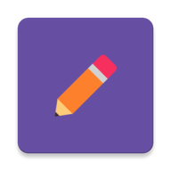

    
    <h3 align="center">NoteIt</h3>
    

        Simple way to take notes.
         
         
        <a href="#try">Try NoteIt</a>
        ·
        <a href="https://github.com/erdemklync/NoteIt/issues">Report Bug</a>
        ·
        <a href="https://github.com/erdemklync/NoteIt/issues">Request Feature</a>
    

## About The Project

<table align="center">
  <tr>
    <td></td>
    <td></td>
    <td></td>
  </tr>
</table>

Technologies and libraries used in this project:
<ul>
  <li>Kotlin</li>
  <li>Clean Architecture</li>
  <li>MVVM</li>
  <li>Room</li>
  <li>Flow</li>
  <li>Hilt</li>
  <li>Material You Design</li>
</ul>

## Contact

LinkedIn - [linkedin.com/in/erdemkalyoncu](https://linkedin.com/in/erdemkalyoncu) 
Medium - [medium.com/@erdemklync](https://medium.com/@erdemklync) 
YouTube - [youtube.com/c/ErdemKalyoncu](https://www.youtube.com/c/ErdemKalyoncu) 

See my other projects: [https://github.com/erdemklync](https://github.com/erdemklync)